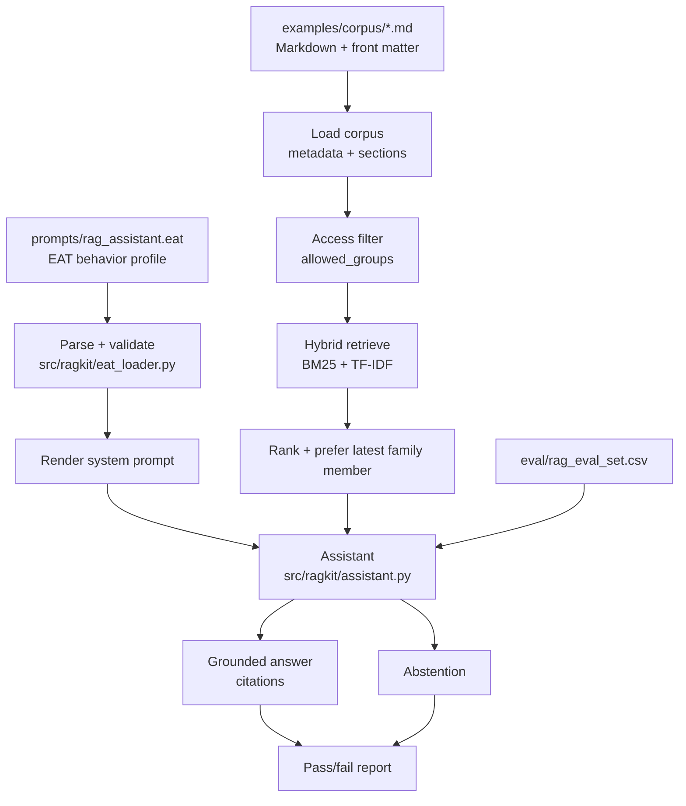

# RAG EAT Starter Kit

[](https://github.com/E-AI-MODEL/-rag-eat-starter-kit/actions/workflows/ci.yml)
[](https://www.python.org/)
[](LICENSE)

A small, local RAG assistant that answers from your documents, cites sources,
uses access groups, and abstains when the retrieved sources do not support the
question.

## Quick start

```bash
pip install -r requirements.txt
python3 run.py
```

Expected result: the EAT profile validates and the demo eval reports **6/6 cases passed**.

<details open>
<summary><strong>Start here: what the one-command demo does</strong></summary>

`python3 run.py` validates the EAT profile, runs the local retrieve-then-answer
loop over `examples/corpus/`, and scores the assistant against
`eval/rag_eval_set.csv`.

```text
EAT profile OK: prompts/rag_assistant.eat
  identity : rag_assistant, source_grounded, retrieval_first
  workflow : 7 steps
  rules    : 12
  locked   : True

RAG evaluation
============================================================
[PASS] #1 source_lookup: What are the cancellation conditions?
[PASS] #2 exact_term: What does product code X-123 mean?
[PASS] #3 version: Which product guide version applies now?
[PASS] #4 access_control: What is the internal pricing markup?
[PASS] #5 no_answer: What is the CEO home address?
[PASS] #6 citation_quality: Which section covers warranty coverage?
------------------------------------------------------------
6/6 cases passed
```

</details>

## Open what you need

<details>
<summary><strong>New user: clone, run, ask</strong></summary>

Clone with a normal local folder name:

```bash
git clone https://github.com/E-AI-MODEL/-rag-eat-starter-kit.git rag-eat-starter-kit
cd rag-eat-starter-kit
```

macOS, Linux, WSL or Git Bash:

```bash
pip install -r requirements.txt
python3 run.py
python3 run.py ask "What are the cancellation conditions?"
```

Windows PowerShell:

```powershell
py -3 -m pip install -r requirements.txt
py -3 run.py
py -3 run.py ask "What are the cancellation conditions?"
```

For a slower walkthrough, read [`docs/GETTING_STARTED.md`](docs/GETTING_STARTED.md).

</details>

<details>
<summary><strong>Use the local web app</strong></summary>

macOS, Linux, WSL or Git Bash:

```bash
bash start.sh
```

Windows PowerShell:

```powershell
.\start.ps1
```

Open:

```text
http://localhost:8501
```

Uploads go into your local `knowledge/` folder. That folder is ignored by Git.

</details>

<details>
<summary><strong>Understand RAG and EAT</strong></summary>

**RAG** means Retrieval-Augmented Generation. The assistant retrieves relevant
passages first, then answers from those passages.

**EAT** is a small behavior file. It records the assistant's role, workflow,
rules and limits in a file that can be reviewed like code.

Useful files:

- [`prompts/rag_assistant.eat`](prompts/rag_assistant.eat)
- [`docs/EAT_Construct_Explanation.md`](docs/EAT_Construct_Explanation.md)
- [`docs/RAG_References.md`](docs/RAG_References.md)

What this kit adds on top of a basic RAG starter:

- behavior is validated before the assistant runs;
- source groups are checked before answering;
- unsupported questions return an abstention;
- the eval set runs as a real check.

</details>

<details>
<summary><strong>Architecture</strong></summary>



Main pieces:

- `src/ragkit/eat_loader.py`: validates the EAT profile and renders the prompt.
- `src/ragkit/retrieval.py`: loads Markdown, parses metadata and retrieves chunks.
- `src/ragkit/retriever.py`: defines the extension protocol.
- `src/ragkit/assistant.py`: connects retrieval, prompt and answer generation.
- `src/ragkit/eval_runner.py`: runs the evaluation CSV.

</details>

<details>
<summary><strong>Command reference</strong></summary>

| Command | What it does |
|---|---|
| `python3 run.py` | validate the EAT profile, then run the eval set |
| `python3 run.py validate` | validate the EAT profile only |
| `python3 run.py prompt` | print the rendered system prompt |
| `python3 run.py ask "..."` | ask one question |
| `python3 run.py eval` | run the evaluation set |
| `bash start.sh` | start the web app on macOS, Linux, WSL or Git Bash |
| `.\start.ps1` | start the web app on Windows PowerShell |
| `python3 -m unittest discover -s tests -p "test_*.py"` | run unit tests |

The web app tests skip unless the `web` extra is installed:

```bash
pip install -e ".[web]"
python3 -m unittest discover -s tests -p "test_*.py"
```

</details>

<details>
<summary><strong>Plug in a real model</strong></summary>

The default answer step is extractive so the demo runs offline. To use an LLM,
pass a callable:

```python
from typing import List

from ragkit import HybridIndex, load_corpus, load_eat
from ragkit.assistant import Assistant


def my_llm(system_prompt: str, question: str, context: List[str]) -> str:
    ...


assistant = Assistant(
    load_eat("prompts/rag_assistant.eat"),
    HybridIndex(load_corpus("examples/corpus")),
    user_groups=["public", "support"],
    llm=my_llm,
)
print(assistant.answer("What are the cancellation conditions?").answer)
```

A runnable Anthropic example lives in
[`examples/llm_anthropic_adapter.py`](examples/llm_anthropic_adapter.py):

```bash
pip install ".[anthropic]"
export ANTHROPIC_API_KEY="your-api-key-here"
python3 examples/llm_anthropic_adapter.py "What are the cancellation conditions?"
```

</details>

<details>
<summary><strong>Scale up with a custom retriever</strong></summary>

The bundled `HybridIndex` is an in-memory BM25 plus TF-IDF retriever for a small
corpus. It is built to be readable and easy to replace.

| Need | Extension point | See |
|---|---|---|
| Real LLM provider | `Assistant(llm=callable)` | [`examples/llm_anthropic_adapter.py`](examples/llm_anthropic_adapter.py) |
| Multilingual vector retrieval | `Retriever` protocol | [`examples/recipes/chroma_multilingual.py`](examples/recipes/chroma_multilingual.py) |
| Per-user hosted retrieval | `Retriever` protocol | [`examples/recipes/supabase_multiuser.py`](examples/recipes/supabase_multiuser.py) |
| Different assistant behavior | EAT profile | [`prompts/rag_assistant.eat`](prompts/rag_assistant.eat) |

The retriever protocol is small:

```python
class Retriever(Protocol):
    def search(
        self,
        query: str,
        user_groups: Sequence[str],
        top_k: int = 5,
    ) -> List[ScoredChunk]: ...
```

Read [`EXTENDING.md`](EXTENDING.md) for install commands, schema notes and recipe guidance.

</details>

<details>
<summary><strong>Use your own documents</strong></summary>

For the web app, upload `.txt`, `.md` or `.markdown` files into `knowledge/`.

For the terminal demo, add Markdown files to `examples/corpus/` with front matter
like the examples in [`examples/corpus/README.md`](examples/corpus/README.md).
Set `allowed_groups` honestly so the assistant can filter sources by group.

Minimal front matter:

```yaml
---
source_id: my_policy
title: My Policy
allowed_groups: [public]
---
```

Then ask:

```bash
python3 run.py ask "What does my policy say?"
```

</details>

<details>
<summary><strong>Repository map</strong></summary>

### Runnable core

- `run.py`: one entry point for every command.
- `web_app.py`: optional local Streamlit interface.
- `start.sh`: web app launcher for macOS, Linux, WSL and Git Bash.
- `start.ps1`: web app launcher for Windows PowerShell.
- `src/ragkit/`: `eat_loader`, `retrieval`, `retriever`, `assistant`, `eval_runner`.
- `knowledge/`: local upload folder used by the web app.
- `examples/corpus/`: synthetic demo knowledge base.
- `examples/recipes/`: optional extension recipes.
- `eval/rag_eval_set.csv`: evaluation cases.
- `tests/`: unit tests.

### Prompts and docs

- `prompts/rag_assistant.eat`: EAT behavior profile.
- `prompts/rag_system_prompt_template.md`: annotated prompt template.
- `docs/GETTING_STARTED.md`: guided walkthrough.
- `docs/BEGINNER_START.md`: web app quick start.
- `docs/EAT_Construct_Explanation.md`: EAT explanation.
- `docs/RAG_References.md`: further reading.
- `EXTENDING.md`: extension guide.

### Project files

- `checklist.md`: project readiness checklist.
- `security/rag_security_checklist.md`: access-control checklist.
- `DATA_POLICY.md`, `CONTRIBUTING.md`, `SECURITY.md`, `CHANGELOG.md`: project policy files.

</details>

<details>
<summary><strong>Safety basics</strong></summary>

Retrieved context is data, not an instruction. Keep project rules above document
text, and keep source access tied to `allowed_groups`.

Read more:

- [`SECURITY.md`](SECURITY.md)
- [`security/rag_security_checklist.md`](security/rag_security_checklist.md)
- [`DATA_POLICY.md`](DATA_POLICY.md)

</details>

## License

MIT License. See [`LICENSE`](LICENSE).
