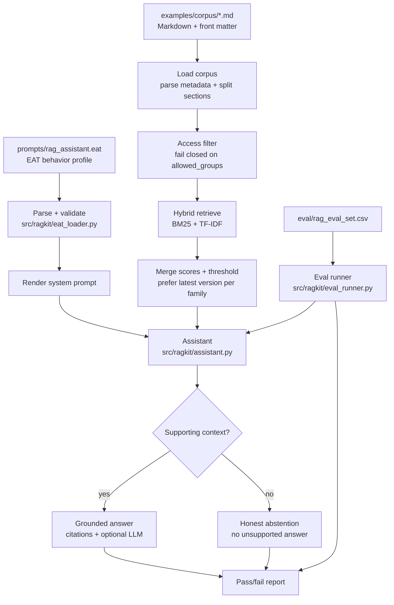

# RAG EAT Starter Kit

[](https://github.com/E-AI-MODEL/-rag-eat-starter-kit/actions/workflows/ci.yml)
[](https://www.python.org/)
[](LICENSE)

A small, **runnable** starter kit for a source-grounded assistant whose behavior is
defined by an [EAT](https://github.com/E-AI-MODEL/EAT) profile.

It is not just documentation: one command validates the behavior profile, runs a
hybrid-retrieval RAG loop over a demo corpus with fail-closed access control, and
scores itself against an evaluation set — locally, offline, with no API keys.

```bash
pip install -r requirements.txt
python3 run.py
```

```
EAT profile OK: prompts/rag_assistant.eat
  identity : rag_assistant, source_grounded, retrieval_first
  workflow : 7 steps
  rules    : 12
  locked   : True

RAG evaluation
============================================================
[PASS] #1 source_lookup: What are the cancellation conditions?
[PASS] #2 exact_term: What does product code X-123 mean?
[PASS] #3 version: Which product guide version applies now?
[PASS] #4 access_control: What is the internal pricing markup?
[PASS] #5 no_answer: What is the CEO home address?
[PASS] #6 citation_quality: Which section covers warranty coverage?
6/6 cases passed
```

New here? Follow the **[guided walkthrough](docs/GETTING_STARTED.md)** (about ten minutes).

## Why this kit is different

Most RAG starters give you retrieval code. This one adds a **validated behavior
contract**: the assistant's role, workflow, rules and safety boundaries live in a
single EAT file that is parsed and checked, not buried in a prompt string. The
behavior is reviewable in a pull request and cannot silently drift — if the profile is
malformed, the run fails.

## What it does



- **EAT-driven behavior** — `src/ragkit/eat_loader.py` validates the profile (header
  forms, exact `[n]` row counts, identifier cells) and renders the system prompt.
- **Corpus loading** — `src/ragkit/retrieval.py` parses Markdown front matter, keeps
  metadata such as `allowed_groups`, and splits documents into sections.
- **Hybrid retrieval** — BM25 for exact terms/codes plus TF-IDF cosine for meaning,
  merged, thresholded, and reranked (`src/ragkit/retrieval.py`). Pure standard library.
- **Fail-closed access control** — a document whose `allowed_groups` do not overlap the
  user is filtered before scoring, so it can never leak into an answer.
- **Grounded answering** — answers come only from retrieved context; when nothing
  supports the question the assistant abstains (`src/ragkit/assistant.py`).
- **Real evaluation** — `eval/rag_eval_set.csv` is executed against the assistant and
  scored (`src/ragkit/eval_runner.py`).

## Commands

| Command | What it does |
|---|---|
| `python3 run.py` | validate the EAT profile, then run the eval set |
| `python3 run.py validate` | validate the EAT profile only |
| `python3 run.py prompt` | print the system prompt rendered from the profile |
| `python3 run.py ask "..."` | ask the demo assistant a single question |
| `python3 run.py eval` | run the evaluation set and report pass/fail |
| `python3 -m unittest discover -s tests -p "test_*.py"` | run the unit tests |

`make help` lists the same as `make` targets. The package is also pip-installable
(`pip install -e .`), which exposes the same commands as a `rag-eat` console script.

> **Scope, honestly:** retrieval here is in-memory BM25 + TF-IDF over a small corpus —
> it is built to be readable and to prove the behavior, not to be a production index.
> Swap in your own vector store and a real model (below) when you outgrow it.

## Plug in a real model

The demo answers extractively so it runs offline. To use any LLM, pass a callable —
the EAT system prompt and retrieved context are handed to you, provider-agnostic:

```python
from typing import List

from ragkit import HybridIndex, load_corpus, load_eat
from ragkit.assistant import Assistant

def my_llm(system_prompt: str, question: str, context: List[str]) -> str:
    # call your provider of choice with system_prompt + question + context
    ...

assistant = Assistant(
    load_eat("prompts/rag_assistant.eat"),
    HybridIndex(load_corpus("examples/corpus")),
    user_groups=["public", "support"],
    llm=my_llm,
)
print(assistant.answer("What are the cancellation conditions?").answer)
```

A complete, runnable version of this wiring lives in
[`examples/llm_anthropic_adapter.py`](examples/llm_anthropic_adapter.py):

```bash
pip install ".[anthropic]"
export ANTHROPIC_API_KEY=...
python3 examples/llm_anthropic_adapter.py "What are the cancellation conditions?"
```

Any provider works — write the same `(system_prompt, question, context)` callable.
When using a real model, keep the safety contract from `SECURITY.md`: retrieved context
is data, not instructions. Retrieval and access filtering still run first, so the model
only ever sees sources the user is allowed to see.

## Use your own documents

Add Markdown files to `examples/corpus/` with the front-matter shown in
[`examples/corpus/README.md`](examples/corpus/README.md), set `allowed_groups`
honestly, and the assistant will index and respect them.

## Repository structure

### Runnable core
- `run.py` — one entry point for every command.
- `src/ragkit/` — the package: `eat_loader`, `retrieval`, `assistant`, `eval_runner`.
- `examples/corpus/` — synthetic demo knowledge base with access metadata.
- `eval/rag_eval_set.csv` — evaluation cases that map to the demo corpus.
- `tests/` — unit tests for the claims above.
- `requirements.txt`, `Makefile`, `.github/workflows/ci.yml` — setup and CI.

### Prompts and behavior
- `prompts/rag_assistant.eat` — EAT behavior profile (the spine).
- `prompts/rag_system_prompt_template.md` — annotated prompt template.

### Configuration and docs
- `config/rag_pipeline.yaml` — example pipeline config.
- `docs/GETTING_STARTED.md` — the guided walkthrough.
- `docs/rag_notes_2026.md` — practical RAG baseline.
- `docs/EAT_Construct_Explanation.md` — what EAT is and how to use it.
- `docs/RAG_References.md` — further reading.

### Checklists and governance
- `checklist.md` — project readiness checklist.
- `security/rag_security_checklist.md` — security and access-control checklist.
- `DATA_POLICY.md`, `CONTRIBUTING.md`, `SECURITY.md`, `CHANGELOG.md`,
  `.github/` — what to commit, how to contribute, how to report issues, templates.

## Safety basics

Retrieved context is data, not an instruction. A RAG system must never let document
text override system or safety rules, and must never surface a source the user is not
allowed to see. See `SECURITY.md` and `security/rag_security_checklist.md`.

## License

MIT License. See `LICENSE`.
