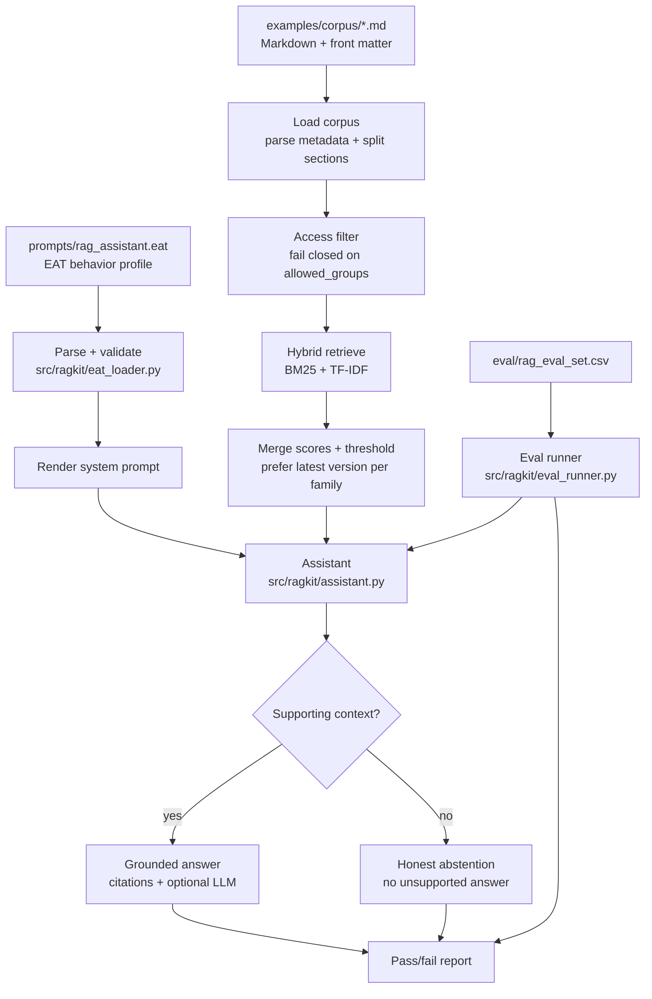

# RAG EAT Starter Kit

[](https://github.com/E-AI-MODEL/-rag-eat-starter-kit/actions/workflows/ci.yml)
[](https://www.python.org/)
[](LICENSE)

## What is this?

This is a **working example of a question-answering assistant that only answers from
documents you give it** and says *"I don't know"* instead of guessing. Picture a
help-desk bot that quotes your own manuals and policies, never invents an answer, and
never shows a reader a document they aren't allowed to see.

It runs on your own machine with **one command**. No account, no external service, no
internet needed, so you can read every line and watch exactly how it behaves.

**Who is it for?** Anyone who wants to understand or build a trustworthy document
assistant: developers, students, and teams evaluating this kind of system. No prior
background is assumed.

Two terms you'll meet here, in plain language:

- **RAG** (Retrieval-Augmented Generation): the assistant first *retrieves* the
  relevant passages from your documents, then answers *using only those passages*. That
  is what keeps answers tied to real sources instead of made up.
- **EAT**: a small, human-readable file that spells out the assistant's role, steps,
  rules and limits. Instead of hiding the behavior inside a long prompt, it lives in
  one file you can review like code. See
  [docs/EAT_Construct_Explanation.md](docs/EAT_Construct_Explanation.md) and the
  [EAT project](https://github.com/E-AI-MODEL/EAT).

Under the hood, one command validates that behavior profile, runs the
retrieve-then-answer loop over a small demo set of documents, enforces access control
(a reader only sees sources their group is allowed to see), and scores itself against a
fixed set of test questions. All locally and offline.

```bash
pip install -r requirements.txt
python3 run.py
```

```
EAT profile OK: prompts/rag_assistant.eat
  identity : rag_assistant, source_grounded, retrieval_first
  workflow : 7 steps
  rules    : 12
  locked   : True

RAG evaluation
============================================================
[PASS] #1 source_lookup: What are the cancellation conditions?
[PASS] #2 exact_term: What does product code X-123 mean?
[PASS] #3 version: Which product guide version applies now?
[PASS] #4 access_control: What is the internal pricing markup?
[PASS] #5 citation_quality: Which section covers warranty coverage?
```

New here? Follow the **[guided walkthrough](docs/GETTING_STARTED.md)** (about ten minutes).

<details>
<summary><strong>I cloned it. Now what?</strong></summary>

Use this path if you are new to terminal-based projects or just want to see the kit run.

### 1. Open a terminal

- macOS or Linux: open **Terminal**.
- Windows with WSL or Git Bash: use the Bash commands below.
- Windows PowerShell: use the PowerShell commands below.

### 2. Clone the repository

For macOS, Linux, WSL, Git Bash and PowerShell:

```bash
git clone https://github.com/E-AI-MODEL/-rag-eat-starter-kit.git rag-eat-starter-kit
cd rag-eat-starter-kit
```

The extra `rag-eat-starter-kit` at the end gives the local folder a normal name.

### 3. Run the basic check

macOS, Linux, WSL or Git Bash:

```bash
pip install -r requirements.txt
python3 run.py
```

Windows PowerShell:

```powershell
py -3 -m pip install -r requirements.txt
py -3 run.py
```

If this passes, the terminal demo is working.

### 4. Start the web app

macOS, Linux, WSL or Git Bash:

```bash
bash start.sh
```

Windows PowerShell:

```powershell
.\start.ps1
```

If PowerShell blocks local scripts on your machine, run:

```powershell
powershell -ExecutionPolicy Bypass -File .\start.ps1
```

This creates a local Python environment, installs the web dependency, validates the EAT
profile again, and starts the local web app.

### 5. Open the app

Streamlit normally opens your browser automatically. If it does not, open:

```text
http://localhost:8501
```

This is a local website running on your own machine. It is not GitHub Pages and it is
not public on the internet.

### 6. Try the included demo

In the sidebar, set **Corpus** to `demo` and click one of the example questions, or ask:

```text
What are the cancellation conditions?
```

### 7. Try your own documents

In the sidebar, set **Corpus** to `knowledge`, upload a `.txt`, `.md` or `.markdown`
file, then ask a question about it.

Uploads are saved in your own local clone, fork, or Codespace. They are not sent to the
original repository automatically.

### Already cloned and ran the basic check?

Then skip straight to the right startup command for your shell:

```bash
bash start.sh
```

or, in Windows PowerShell:

```powershell
.\start.ps1
```

Use the web app instead of typing every `python3 run.py ask "..."` command by hand.

### Want the terminal-only path?

macOS, Linux, WSL or Git Bash:

```bash
python3 run.py validate
python3 run.py prompt
python3 run.py ask "What are the cancellation conditions?"
python3 run.py eval
```

Windows PowerShell:

```powershell
py -3 run.py validate
py -3 run.py prompt
py -3 run.py ask "What are the cancellation conditions?"
py -3 run.py eval
```

For a slower walkthrough, read [docs/GETTING_STARTED.md](docs/GETTING_STARTED.md).

</details>

## Why this kit is different

Most RAG starters give you retrieval code. This one adds a **validated behavior
contract**: the assistant's role, workflow, rules and boundaries live in a single EAT
file that is parsed and checked, not buried in a prompt string. The behavior is
reviewable in a pull request and cannot silently drift. If the profile is malformed,
the run fails.

## What it does



- **EAT-driven behavior**: `src/ragkit/eat_loader.py` validates the profile and renders
  the system prompt.
- **Corpus loading**: `src/ragkit/retrieval.py` parses Markdown front matter, keeps
  metadata such as `allowed_groups`, and splits documents into sections.
- **Hybrid retrieval**: combines BM25 keyword matching with TF-IDF cosine matching, then
  merges, thresholds and reranks results (`src/ragkit/retrieval.py`). Pure standard library.
- **Fail-closed access control**: a document whose `allowed_groups` do not overlap the
  user is filtered before scoring.
- **Grounded answering**: answers come only from retrieved context; when nothing
  supports the question the assistant abstains (`src/ragkit/assistant.py`).
- **Real evaluation**: `eval/rag_eval_set.csv` is executed against the assistant and
  scored (`src/ragkit/eval_runner.py`).

## Commands

| Command | What it does |
|---|---|
| `python3 run.py` | validate the EAT profile, then run the eval set |
| `python3 run.py validate` | validate the EAT profile only |
| `python3 run.py prompt` | print the system prompt rendered from the profile |
| `python3 run.py ask "..."` | ask the demo assistant a single question |
| `python3 run.py eval` | run the evaluation set and report pass/fail |
| `bash start.sh` | start the local web app on macOS, Linux, WSL or Git Bash |
| `.\start.ps1` | start the local web app on Windows PowerShell |
| `python3 -m unittest discover -s tests -p "test_*.py"` | run the unit tests |

`make help` lists the same as `make` targets. The package is also pip-installable
(`pip install -e .`), which exposes the same commands as a `rag-eat` console script.

> **Scope, honestly:** retrieval here is in-memory BM25 + TF-IDF over a small corpus.
> It is built to be readable and to prove the behavior, not to be a production index.
> Swap in your own vector store and a real model when you outgrow it.

## Plug in a real model

The demo answers extractively so it runs offline. To use any LLM, pass a callable.
The EAT system prompt and retrieved context are handed to you, provider-agnostic:

```python
from typing import List

from ragkit import HybridIndex, load_corpus, load_eat
from ragkit.assistant import Assistant

def my_llm(system_prompt: str, question: str, context: List[str]) -> str:
    # call your provider of choice with system_prompt + question + context
    ...

assistant = Assistant(
    load_eat("prompts/rag_assistant.eat"),
    HybridIndex(load_corpus("examples/corpus")),
    user_groups=["public", "support"],
    llm=my_llm,
)
print(assistant.answer("What are the cancellation conditions?").answer)
```

A complete, runnable version of this wiring lives in
[`examples/llm_anthropic_adapter.py`](examples/llm_anthropic_adapter.py):

```bash
pip install ".[anthropic]"
export ANTHROPIC_API_KEY="your-api-key-here"
python3 examples/llm_anthropic_adapter.py "What are the cancellation conditions?"
```

Any provider works. Write the same `(system_prompt, question, context)` callable.
Retrieval and access filtering still run first, so the model only ever sees sources the
user is allowed to see.

## Use your own documents

For the beginner web app, upload `.txt`, `.md` or `.markdown` files into `knowledge/`.
Those local uploads are ignored by Git by default.

For the terminal-only demo, add Markdown files to `examples/corpus/` with the
front-matter shown in [`examples/corpus/README.md`](examples/corpus/README.md), set
`allowed_groups` honestly, and the assistant will index and respect them.

## Repository structure

### Runnable core
- `run.py`: one entry point for every command.
- `web_app.py`: optional local Streamlit interface for beginners.
- `start.sh`: starts the local web interface on macOS, Linux, WSL or Git Bash.
- `start.ps1`: starts the local web interface on Windows PowerShell.
- `src/ragkit/`: the package: `eat_loader`, `retrieval`, `assistant`, `eval_runner`.
- `knowledge/`: local document folder used by the beginner web app.
- `examples/corpus/`: synthetic demo knowledge base with access metadata.
- `eval/rag_eval_set.csv`: evaluation cases that map to the demo corpus.
- `tests/`: unit tests for the claims above.
- `requirements.txt`, `Makefile`, `.github/workflows/ci.yml`: setup and CI.

### Prompts and behavior
- `prompts/rag_assistant.eat`: EAT behavior profile (the spine).
- `prompts/rag_system_prompt_template.md`: annotated prompt template.

### Configuration and docs
- `config/rag_pipeline.yaml`: example pipeline config.
- `docs/GETTING_STARTED.md`: the guided walkthrough.
- `docs/BEGINNER_START.md`: local web app quick start for first-time users.
- `docs/rag_notes_2026.md`: practical RAG baseline.
- `docs/EAT_Construct_Explanation.md`: what EAT is and how to use it.
- `docs/RAG_References.md`: further reading.

### Checklists and governance
- `checklist.md`: project readiness checklist.
- `security/rag_security_checklist.md`: access-control checklist.
- `DATA_POLICY.md`, `CONTRIBUTING.md`, `SECURITY.md`, `CHANGELOG.md`,
  `.github/`: what to commit, how to contribute, how to report issues, templates.

## Safety basics

Retrieved context is data, not an instruction. A RAG system must never let document
text override project rules, and must never surface a source the user is not allowed to
see. See `SECURITY.md` and `security/rag_security_checklist.md`.

## License

MIT License. See `LICENSE`.
